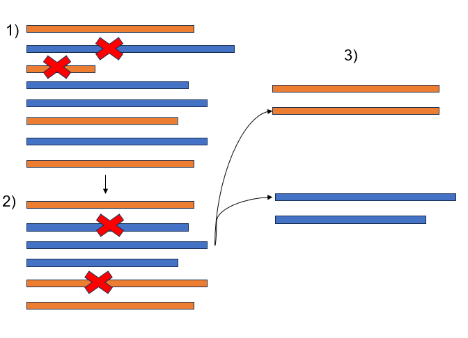
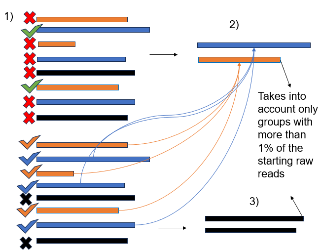

#  RREQUESTED MANUAL #

### -General purpose and applicability

RREQUESTED (Raw REads QUality Extraction, Size Trimming and Ex-novo Demultiplexing) is a modular shellscript tool that combines three different python scripts and allows preprocessing (quality filtering, size selection and demultiplexing) of raw basecalled reads, especially produced by Oxford Nanopore, a Third Generation Sequencing technology.

It is easy-to-use, it requires only two python packages to be installed for the analysis and it is fairly quick, given the computational amount that it has to parse. 

Even though the program has been tested only on Nanopore sequencing results, the program could be cautiously applied also to products from NGS or other ThirdGen technologies. 

Here you can have a simple visualization of the three main step: quality filtering (1), size selection (2) and demultiplexing (3):




### -Installation 
The basic requirment for this installation is to have  [Mamba](https://mamba.readthedocs.io/en/latest/installation/mamba-installation.html) and [Conda](https://conda.io/projects/conda/en/latest/user-guide/install/index.html) up and running on your Linux machine. If you don't match this pre-requisite, consider downloading them from the dedicated pages.

First of all, download the RREQUESTED folder and place it within your working environment with:

```bash
git init
git clone https://github.com/AstraBert/RREQUESTED/
```

Now run:

```bash
cd RREQUESTED
bash scripts/install.sh
```

to install all the necessary dependencies, and test the installation with:

```bash
source ~/.bash_aliases
RREQ -h
```

You can alternatively download the .tar.gz archive in the Releases page, move to the folder where you have downloaded the archive and then run:

```bash
tar -xzvf ./RREQUESTED.tar.gz
cd RREQUESTED
bash install.sh
source ~/.bash_aliases
RREQ -h
```

### -Command-line arguments
RREQUESTED takes one required argument (the directory in which you placed all your files with raw reads, in fasta/fastq format, gzipped or not) and three optional ones (minimum average read quality, minimum and maximum length): 

```
Usage: RREQ -d, --directory RAW_READS_DIRECTORY [-q,--quality QUALITY] [-mi,--min MINIMUM_LENGTH] [-ma,--max MAXIMUM_LENGTH]

  REQUIRED ARGUMENTS:
  -RAW_READS_DIRECTORY: Provide the path to the directory where raw reads are stored in fasta/fasta.gz/fastq/fastq.gz format (can accept also format mixture, but would be better to have all the file in the same format)

  OPTIONAL ARGUMENTS:
  -QUALITY: Provide the value of minimum average read quality for filtering (default: 7)
  -MINIMUM_LENGTH: Provide the minimum length of PCR product for size selection (default is 500)
  -MAXIMUM_LENGTH: Provide the maximum length of PCR product for size selection (default is 10000)

  
  Input RREQ -h to show this message again
```

There is no need to specify anything about demultiplexing: RREQUESTED will do it automatically without any reference (that's why we say this is an *ex-novo* demultiplexing)

Here's an example run:

```bash
RREQ -d /path/to/reads/folder -q 10 -mi 550 -ma 8000
```

### -How does it work? ###
There are five steps in RREQUESTED analysis:
1. RREQUESTED will check that the provided directory exists *and* is actually a directory, then it will search for fasta, fastq, fasta.gz and fastq.gz files: the working directory could potentially contain also a mixture of these file types, as the program is set to recognize and treat them differently based on their format.
2. After having found the files, RREQUESTED creates a results directory where it will copy all the raw reads files, and then the analysis can begin.
3. The quality filtering step is based on the easiest implementation one could think of: for every read, the filtering algorithms takes the mean quality and discards the reads that are under a given value (default is 7, so this step will take place nevertheless if the file is fastq/fastq.gz)
4. The size filtering step is also based on the easiest implementation one could think of: for every read, the filtering algorithms takes the length and, if this is below the minimum or above the maximum allowed, the read gets discarded. Minimum and maximum are set by default at 500 and 10000bp, so this step will take place nevertheless with all formats of files.
5. The demultiplexing step is the last portion of the program, and takes place by default as for the previous passages. It is based on super-fast global alignment and it is divided into two main parts: in the first, the demultiplexer identifies unique (higly divergent) reads (1), that are the ones which score less than 50% in similarity with all the other sequences. After that, it globaly aligns all the raw reads against the "self-made reference", grouping the ones that share more than 70% of their code (2). After having demultiplexed this way, the program checks the leftovers, to see wether there are worthy-to-save data or not. This brings to a five-round cycle that identifies higly divergent sequences in the non-grouped ones and clusters the "nogroup" reads against them (3). If there are still ungrouped remainders after this step, they get clustered together (3). Only groups encompassing more than 1% of the total reads will be written as demultiplexed fasta files, named N.fasta (where N is a number) or nogroup.fasta if they belong to the unclustered reads: they could be found in the folder basefilename-extensionabbreviation-demultiplexed (an example could be: if you are demultiplexing a file named coleoptera.fastq, the folder will be coleoptera-fq-demultiplexed)

Here you can see a nicer visualization of unreferenced demultiplexing:




### -Test data
You can test the efficiency of RREQUESTED by running it on data from Greatens et al. (2023), and, after having BLASTed the demultiplexed files against the provided reference sequences turned into a database, you will be able to check demultiplexing reliability by running the result_parser.py script. 

Base your testing on the following script (assuming you already moved to RREQUESTED directory:

```bash
cd test
folder=$(realpath ./)
RREQ -d $folder -q 3 -mi 400 -ma 2000
makeblastdb -in ${folder}/ref.fa -dbtype nucl -out ${folder}/refDB
c=0
for i in /path/to/reads/folder/results/demultiplexed-fq-GreatensEtAl/*.fasta
do
  ((c+=1))
  blastn -num_threads 4 -max_target_seqs 1 -outfmt "6 qseqid sseqid slen qlen pident qcovs length mismatch gapopen qstart qend sstart send evalue bitscore" -db ${folder}/refDB -query $i > ${folder}/${c}.blast
done
python3 ${folder}/result_parser.py -d ${folder}
```

### -Benchmarking
RREQUESTED was benchmarked against 20 fastq files containg 7500 reads obtained with [simON-reads](https://github.com/AstraBert/simON-reads), each starting from 5 randomly generated sequences (with a lenght between 450 and 800 bp). In all this cases, it yielded 0% contamination and correctly demultiplexed everything. 

On the other hand, it was tried on 7 datasets of artificially generated reads obtained with [simON-reads](https://github.com/AstraBert/simON-reads) from NCBI Nucleotide sequences:

- The first contained 28S-rRNA and S7 rRNA from two Coleoptera species; it returned 0% contamination and demultipledxed the two loci correctly.
- The second contained _Mus musculus_ sequences with accession number: LC124947.1, U72947.1, CZ170435.1; it returned 0% contamination and demultiplexed the three loci correctly.
- The third contained COI barcodes from four _Bradypus_ species: _B. torquatus_, _B. tridactylus_, _B. variegatus_, _B. pygmaeus_; it returned 100% contamination error (all reads were clustered together due to high sequence similarity caused by low divergence time among species)
- The fourth contained RAG1 sequences from _Hemicentes semispinosus_, _Erinaceus europaeus_, _Loxodonta africana_; it returned 0% contamination and demultiplexed the three loci correctly.
- The fifth contained PLAC1 sequences from _Leopardus geoffroyi_, _Ursus arctos_ and _Homo sapiens_; it returned 0% contamination and demultipledxed the three loci correctly.
- The sixth contained seven COI Sanger sequences from Maestri et al. (2019); it returned about 50% contamination in H43-H37 and H42-H36, demultiplexing these four units in only two groups, while being able to recognize the other three correctly.
- The seventh contained COI sequences from _Macaca fascicularis_, _Cheracebus lugens_, _Macaca fascicularis_; it returned 0% contamination and demultiplexed the three loci correctly.


### -Final considerations ###
As a practical suggestion, we strongly advise to be cautious while using RREQUESTED with files containing reads from multiple individuals, especially if the quality of the data is low and/or there is a high phylogenetic affinity among the demultiplexing units.

Moreover, please note that RREQUESTED is still experimental and may contain errors, may fail/take really long while performing large analyses with limited computational power (e.g. on a normal laptop) and may output not-100%-reliable results, so always check them and pull issues whenever you feel it to be the case, we'll be on your back as soon as possible to fix/implement/enhance whatever you suggest!


### -License and rights of usage ###
The code is protected by the GNU v.3 license. As the license provider reports: "Permissions of this strong copyleft license are conditioned on making available complete source code of licensed works and modifications, which include larger works using a licensed work, under the same license. Copyright and license notices must be preserved. Contributors provide an express grant of patent rights".
