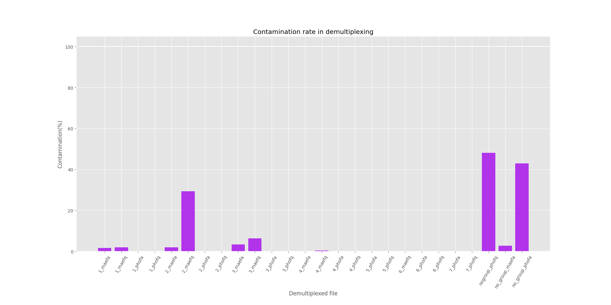

#  RREQUESTED MANUAL #

### -General purpose and applicability

RREQUESTED (Raw REads QUality Extraction, Size Trimming and Ex-novo Demultiplexing) is a modular shellscript tool that combines three different python scripts and allows preprocessing (quality filtering, size selection and demultiplexing) of raw basecalled reads, especially produced by Oxford Nanopore, a Third Generation Sequencing technology.

It is easy-to-use, it requires only two python packages to be installed for the analysis and it is fairly quick, given the computational amount that it has to parse. 

Even though the program has been tested only on Nanopore sequencing results, the program could be cautiously applied also to products from NGS or other ThirdGen technologies. 


### -Installation 
Follow instructions in [install.sh](./scripts/install.sh) to view a comprehensive guide and set up everything.

To run the program, you need first of all to be in a POSIX/POSIX-like operating system and to have a Python environment installed (version 3 or later).

Besides that, you should have `pandas` and `edlib` installed, at least in your working environment; if you haven't got them yet, please download the required packages at the following links:
- [pandas](https://pandas.pydata.org/)
- [edlib](https://pypi.org/project/edlib/)

After having fulfilled these basic requirements, just download the RREQUESTED folder and place it within your working environment with:

```bash
cd /path/to/working/environment
git init
git clone https://github.com/AstraBert/RREQUESTED/
```

Now run:

```bash
cd /usr/local/bin
sudo cp -r /absolute/path/to/RREQUESTED ./
sudo ln -s /usr/local/bin/RREQUESTED/scripts/RREQUESTED.sh RREQ
```

to make the program an executable, and test the installation with:

```bash
RREQ -h
```

### -Command-line arguments
RREQUESTED takes one required argument (the directory in which you placed all your files with raw reads, in fasta/fastq format, gzipped or not) and three optional ones (minimum average read quality, minimum and maximum length): 

```
Usage: RREQ -d, --directory RAW_READS_DIRECTORY [-q,--quality QUALITY] [-mi,--min MINIMUM_LENGTH] [-ma,--max MAXIMUM_LENGTH]

  REQUIRED ARGUMENTS:
  -RAW_READS_DIRECTORY: Provide the path to the directory where raw reads are stored in fasta/fasta.gz/fastq/fastq.gz format (can accept also format mixture, but would be better to have all the file in the same format)

  OPTIONAL ARGUMENTS:
  -QUALITY: Provide the value of minimum average read quality for filtering (default: 7)
  -MINIMUM_LENGTH: Provide the minimum length of PCR product for size selection (default is 500)
  -MAXIMUM_LENGTH: Provide the maximum length of PCR product for size selection (default is 10000)

  
  Input RREQ -h to show this message again
```

There is no need to specify anything about demultiplexing: RREQUESTED will do it automatically without any reference (that's why we say this is an *ex-novo* demultiplexing)

Here's an example run:

```bash
RREQ -d /path/to/reads/folder -q 10 -mi 550 -ma 8000
```

### -How does it work? ###
There are five steps in RREQUESTED analysis:
1. RREQUESTED will check that the provided directory exists *and* is actually a directory, then it will search for fasta, fastq, fasta.gz and fastq.gz files: the working directory could potentially contain also a mixture of these file types, as the program is set to recognize and treat them differently based on their format.
2. After having found the files, RREQUESTED creates a results directory where it will copy all the raw reads files, and then the analysis can begin.
3. The quality filtering step is based on the easiest implementation one could think of: for every read, the filtering algorithms takes the mean quality and discards the reads that are under a given value (default is 7, so this step will take place nevertheless if the file is fastq/fastq.gz)
4. The size filtering step is also based on the easiest implementation one could think of: for every read, the filtering algorithms takes the length and, if this is below the minimum or above the maximum allowed, the read gets discarded. Minimum and maximum are set by default at 500 and 10000bp, so this step will take place nevertheless with all formats of files.
5. The demultiplexing step is the last portion of the program, and takes place by default as for the previous passages. It is based on super-fast global alignment and it is divided into two main parts: in the first, the demultiplexer identifies unique (higly divergent) reads, that are the ones which score less than 50% in similarity with all the other sequences. After that, it globaly aligns all the raw reads against the "self-made reference", grouping the ones that share more than 70% of their code. After having demultiplexed this way, the program checks the leftovers, to see wether there are worthy-to-save data or not. This brings to a five-round cycle that identifies higly divergent sequences in the non-grouped ones and clusters the "nogroup" reads against them. If there are still ungrouped remainders after this step, they get clustered together. Only groups encompassing more than 1% of the total reads will be written as demultiplexed fasta files, named N.fasta (where N is a number) or nogroup.fasta if they belong to the unclustered reads: they could be found in the folder basefilename-extensionabbreviation-demultiplexed (an example could be: if you are demultiplexing a file named coleoptera.fastq, the folder will be coleoptera-fq-demultiplexed)


### -Benchmarking 
Benchmarking was conducted on a folder with 4 files: two were the fasta and the fastq.gz version of two concatenated individuals from Maestri et al. (2019), specifically Colen and H37 (two beetles); the other two were the fastq and the fasta.gz version of barcode 15 in Susanne Reier's dataset on *Phoxinus* (common minnow). These files contained a total of 99400 reads. 

RREQUESTED, on a normal laptop, took 1h11m39s (4299s) of real time to complete the full analysis. 

It succesfully demultiplexed all four files, and we checked, by BLASTing all the demultiplexed files against their reference databases, that indeed there was no messing up. We collected everything in the following file: [demultiplexing_stats.md](./benchmarking/demultiplexing_stats.md). 

As a summary for the previously mentioned statistics, it can be said that:

- All the expected loci/individuals have been succesfully separated both for Maestri and for *Phoxinus* data
- There is still some white noise in Maestri (markedly less in *Phoxinus*) produced by the high sensibility of the demultiplexing algorithm. As a matter of facts, it doesn't simply tell apart the individuals from one another, but also it separates the sequences themselves within each single individual (moreover, data by Maestri are quite old and thus, compared to *Phoxinus* ones, from 2022, they have a noticeably inferior quality).
- There is only one case of an actual group (one of the N.fasta files) that had a high contamination rate (2.fasta from the fastq version of Maestri, indicated as 2_maefq in the following figure).

The contamination rate was computed as the complementary fraction of the maximum number of hits per individual or locus divided by the total number of hits (so, for instance, if Colen was hit 455 times and H37 was hit 5 times in the same file, the rate of contamination for that file would be 1-455/460). Here is the figure that shows this rate per file: every file is labelled by a number (or nogroup), the first three letters of the dataset they came from (mae or pho) and the abbreviation of their extension (fa or fq).




### -Final considerations ###
As a practical suggestion, we strongly advise to be cautious while using RREQUESTED with files containing reads from multiple individuals, especially if the quality of the data is low: not because there is the risk that you will miss something, but because it can produce more groups than needed.

Moreover, please note that RREQUESTED is still experimental and may contain errors, may fail/take really long while performing large analyses with limited computational power (e.g. on a normal laptop) and may output not-100%-reliable results, so always check them and pull issues whenever you feel it to be the case, we'll be on your back as soon as possible to fix/implement/enhance whatever you suggest!


### -License and rights of usage ###
The code is protected by the GNU v.3 license. As the license provider reports: "Permissions of this strong copyleft license are conditioned on making available complete source code of licensed works and modifications, which include larger works using a licensed work, under the same license. Copyright and license notices must be preserved. Contributors provide an express grant of patent rights".
